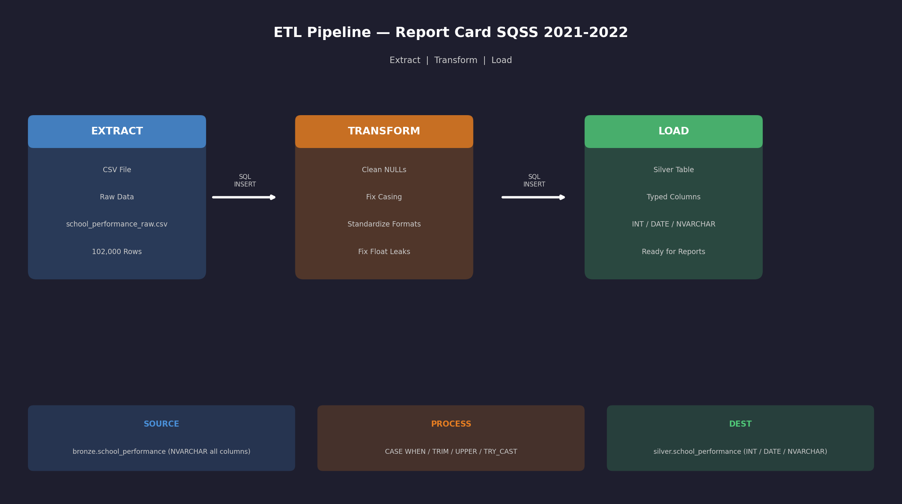
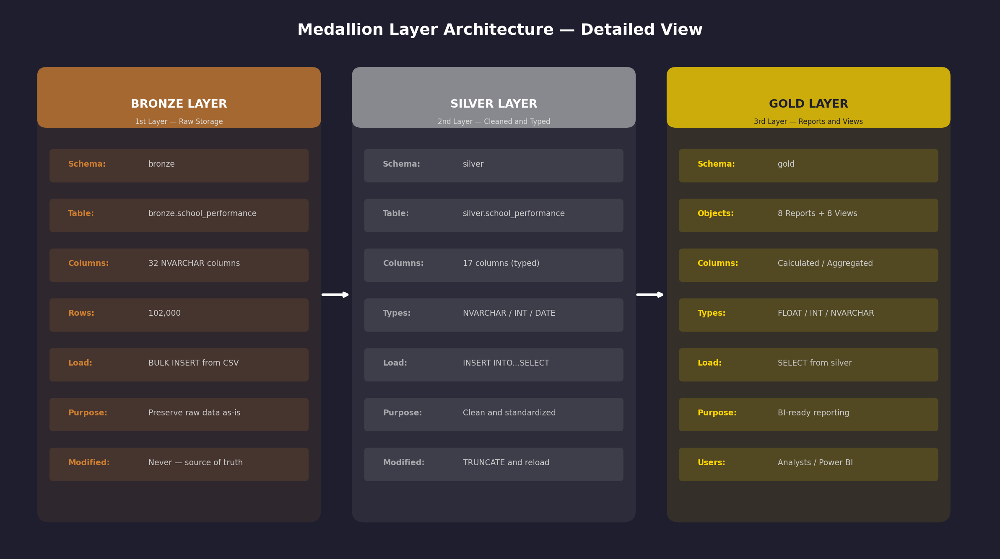
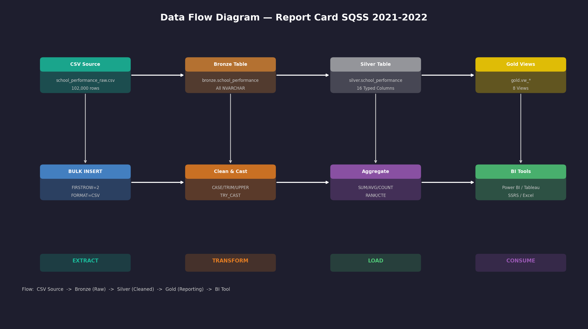

# sql-school-performance-etl

> End-to-end SQL data engineering project built on Washington State OSPI Report Card SQSS 2021-2022 data.
> Implements a full Medallion Architecture (Bronze / Silver / Gold) with data cleaning, typed layers, Gold reports, and BI-ready views.

---

## Project Overview

This project demonstrates a complete **ETL pipeline** and **Medallion Data Architecture** using SQL Server.
Raw school performance data from Washington State is ingested, cleaned, typed, and transformed into
reporting-ready views for analysts and BI tools.

| Property        | Value                                      |
|-----------------|--------------------------------------------|
| Data Source     | OSPI Report Card SQSS 2021-2022 (CSV)      |
| Database        | reportcard_sqss_2021_2022                  |
| Architecture    | Medallion — Bronze / Silver / Gold         |
| Rows Loaded     | 102,000                                    |
| SQL Dialect     | SQL Server (T-SQL)                         |
| Tools           | SSMS, SQL Server 2019+                     |

---

## Project Structure

```
sql-school-performance-etl/
|
|-- bronze/
|   |-- ddl_bronze_school_performance.sql
|   |-- bulk_insert_bronze.sql
|
|-- silver/
|   |-- ddl_silver_school_performance.sql
|   |-- data_cleaning_bronze_school_performance.sql
|   |-- proc_load_silver_school_performance.sql
|
|-- gold/
|   |-- gold_01_graduation_rate_by_district.sql
|   |-- gold_02_achievement_gap_analysis.sql
|   |-- gold_03_advanced_course_participation.sql
|   |-- gold_04_chronic_absenteeism_report.sql
|   |-- gold_05_school_type_performance.sql
|   |-- gold_06_county_level_scorecard.sql
|   |-- gold_07_grade_level_proficiency.sql
|   |-- gold_08_college_readiness_report.sql
|   |-- gold_views_all.sql
|
|-- docs/
|   |-- naming_convention.docx
|   |-- ETL.png
|   |-- DATA_ARCHITECTURE.png
|   |-- DATA_FLOW.png
|   |-- DATA_INTEGRATION.png
|   |-- LAYERS.png
|   |-- DATA_MODEL.png
|
|-- dataset/
|   |-- school_performance_raw.csv
|
|-- README.md
```

---

## ETL Pipeline

<p align="center">
  
</p>

The pipeline follows three stages:

- **Extract** — CSV file loaded into Bronze via `BULK INSERT`
- **Transform** — Cleaning applied via `CASE WHEN`, `TRIM`, `UPPER`, `TRY_CAST`
- **Load** — Cleaned data inserted into Silver with proper data types

```sql
BULK INSERT bronze.school_performance
FROM 'path\to\school_performance_raw.csv'
WITH
(
    FORMAT          = 'CSV',
    FIRSTROW        = 2,
    FIELDTERMINATOR = ',',
    ROWTERMINATOR   = '0x0a',
    FIELDQUOTE      = '"',
    TABLOCK
);
```

---

## Medallion Layers

<p align="center">
  
</p>

### Bronze Layer

Raw data ingested directly from CSV with no transformations.
All columns stored as `NVARCHAR` to preserve original values exactly.

- 32 NVARCHAR columns
- 102,000 rows
- Never modified after load
- Source of truth for all downstream layers

### Silver Layer

Cleaned, standardized, and typed data loaded from Bronze.

#### Data Quality Issues Fixed

| Issue | Example | Fix Applied |
|-------|---------|-------------|
| Mixed date formats | `2021-2022`, `21-22`, `2021/22` | Standardized to `2021-22` |
| Mixed case | `king`, `PIERCE`, `WHITE` | Title case via `UPPER() + TRIM()` |
| String NULL | `'NULL'`, `'N/A'`, `'--'` | Converted to `'n/a'` or real `NULL` |
| Float leak | `3542.0`, `610.0` | Converted via `TRY_CAST` to `INT` |
| Percent sign | `26.5%` | Stripped via `REPLACE()` |
| Duplicate rows | ~2,000 exact duplicates | Removed |
| Typos | `Schoool`, `hispanic/latino` | Corrected to standard values |
| Logical errors | Numerator > Denominator | Flagged and corrected |

#### NULL Handling Rules

| Column Type | Missing Value | Reason |
|-------------|---------------|--------|
| NVARCHAR (text) | `'n/a'` | Consistent text placeholder |
| INT (numbers) | `NULL` | Allows `SUM()`, `AVG()`, `COUNT()` |
| DATE | `NULL` | Cannot store string in DATE column |

#### Silver Table Columns (17)

| Column | Type | Description |
|--------|------|-------------|
| SchoolYear | NVARCHAR(20) | e.g. 2021-22 |
| County | NVARCHAR(100) | e.g. King, Pierce |
| DistrictName | NVARCHAR(200) | e.g. Seattle School District |
| SchoolName | NVARCHAR(200) | e.g. Lincoln Elementary |
| CurrentSchoolType | NVARCHAR(50) | Traditional / Charter / Alternative |
| StudentGroup | NVARCHAR(200) | e.g. Hispanic/Latino, White |
| GradeLevel | NVARCHAR(50) | e.g. Grade 9, All Grades |
| Measure | NVARCHAR(200) | e.g. Graduation Rate |
| Numerator | INT | Students meeting criteria |
| Denominator | INT | Total eligible students |
| NumberTakingAP | INT | Advanced Placement count |
| NumberTakingIB | INT | International Baccalaureate count |
| NumberTakingCollegeInTheHighSchool | INT | College in High School count |
| NumberTakingCambridge | INT | Cambridge program count |
| NumberTakingRunningStart | INT | Running Start count |
| NumberTakingCTETechPrep | INT | CTE Tech Prep count |
| DataAsOf | DATE | Standardized to YYYY-MM-DD |

### Gold Layer

Aggregated, calculated, and BI-ready reports and views.

#### 8 Gold Reports

| # | Report | Key Insight |
|---|--------|-------------|
| 01 | Graduation Rate by District | Which districts have highest graduation rates? |
| 02 | Achievement Gap Analysis | How do student groups compare to All Students? |
| 03 | Advanced Course Participation | Which groups participate in AP / IB / CHS? |
| 04 | Chronic Absenteeism | Which counties have worst absenteeism rates? |
| 05 | School Type Performance | Do Charter schools outperform Traditional? |
| 06 | County Level Scorecard | Overall county performance ranking |
| 07 | Grade Level Proficiency | Which grades struggle most in Math/ELA? |
| 08 | College Readiness | How college-ready are students by district? |

#### 8 BI-Ready Views

```sql
SELECT * FROM gold.vw_graduation_rate_by_district
SELECT * FROM gold.vw_achievement_gap
SELECT * FROM gold.vw_advanced_course_participation
SELECT * FROM gold.vw_chronic_absenteeism
SELECT * FROM gold.vw_school_type_performance
SELECT * FROM gold.vw_county_scorecard
SELECT * FROM gold.vw_grade_level_proficiency
SELECT * FROM gold.vw_college_readiness
```

---

## Data Flow

<p align="center">
  
</p>

The data moves through four stages:

- **Extract** — CSV source loaded into Bronze table
- **Transform** — Cleaning and type casting applied in Silver
- **Load** — Aggregated into Gold reports and views
- **Consume** — Analysts and BI tools query Gold views directly

---

## Key SQL Techniques Used

| Technique | Where Used |
|-----------|-----------|
| `BULK INSERT` | Bronze ingestion |
| `CASE WHEN / TRIM / UPPER` | Silver cleaning |
| `TRY_CAST` | Safe type conversion |
| `INSERT INTO...SELECT` | Bronze to Silver load |
| `CTE (WITH clause)` | Gold report 02, 06 |
| `RANK() OVER (ORDER BY)` | Gold ranking columns |
| `PARTITION BY` | Gold report 05, 07 |
| `NULLIF()` | Safe division by zero |
| `ISNULL()` | NULL-safe aggregations |
| `MAX(CASE WHEN)` | Pivot in Gold report 06 |
| `CREATE VIEW` | Gold BI views |
| `TRUNCATE + INSERT` | Silver reload pattern |

---

## How to Run

**Step 1 — Create Bronze table and load data**
```sql
-- Run: bronze/ddl_bronze_school_performance.sql
-- Run: bronze/bulk_insert_bronze.sql
```

**Step 2 — Create Silver table**
```sql
-- Run: silver/ddl_silver_school_performance.sql
```

**Step 3 — Clean and load Silver**
```sql
-- Run: silver/proc_load_silver_school_performance.sql
```

**Step 4 — Run Gold reports**
```sql
-- Run any: gold/gold_01_*.sql through gold_08_*.sql
```

**Step 5 — Create Gold views**
```sql
-- Run: gold/gold_views_all.sql
```

**Step 6 — Verify row counts**
```sql
SELECT 'Bronze' AS Layer, COUNT(*) AS TotalRows FROM bronze.school_performance
UNION ALL
SELECT 'Silver' AS Layer, COUNT(*) AS TotalRows FROM silver.school_performance;
```

---

## Data Source

Washington State Office of Superintendent of Public Instruction (OSPI)
Report Card SQSS (Student Success and Support) 2021-2022
Open data available at: [data.wa.gov](https://data.wa.gov)

---

## Author

[Your Name]
SQL Data Engineering Project — 2026
